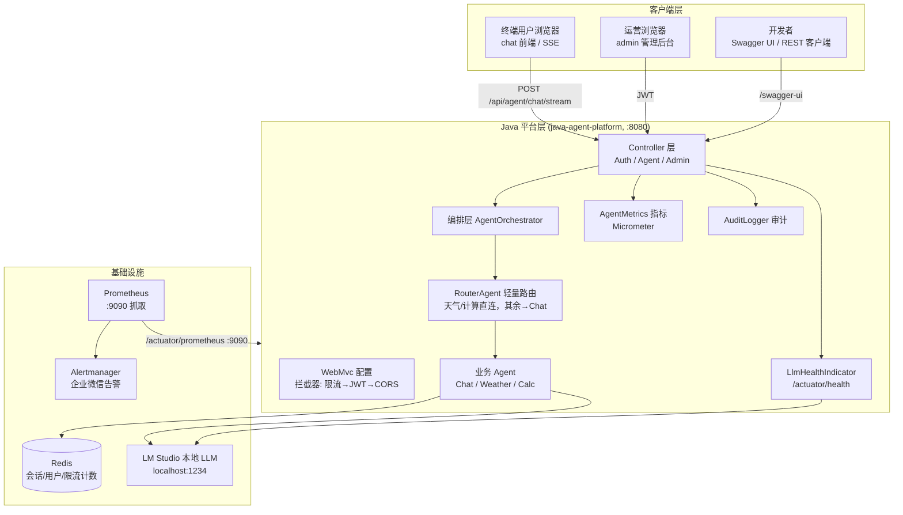
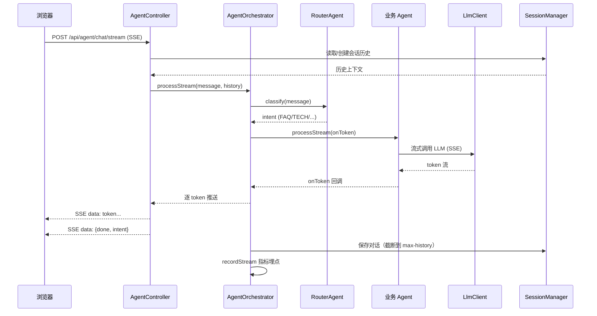

# SmartService-Agent 架构设计文档

> 版本：1.0 · 2026-09 · 配套代码库：SmartService-Agent

## 1. 系统架构总览



## 2. 分层说明

| 层 | 关键类 | 职责 |
|---|---|---|
| Controller | AuthController / AgentController / AdminController | 参数校验、统一响应体、SSE、JWT 上下文 |
| 编排 | AgentOrchestrator / RouterAgent | 路由决策、统一执行、错误降级、指标埋点 |
| 业务 Agent | ChatAgent / WeatherAgent / CalcAgent | 通用对话（主）/ 天气查询 / 数学计算（工具）|
| 安全 | AuthService / JwtUtil / JwtAuthInterceptor | BCrypt + JWT 签发校验 |
| 基础设施 | SessionManager / LlmClient / RateLimitInterceptor / AuditLogger | 会话持久化、LLM 调用、限流、审计 |
| 可观测 | AgentMetrics / LlmHealthIndicator | 指标、健康 |

## 3. 核心请求时序（流式对话）



## 4. 数据设计（Redis Key 约定）

| Key 模式 | 用途 | TTL |
|---|---|---|
| `agent:session:{sessionId}` | 会话消息列表（Hash/List） | 24h |
| `agent:session:index` | 会话索引（ZSet，按最后活动排序） | — |
| `agent:user:{username}` | 用户信息（Hash: passwordHash/role/createdAt） | 永久 |
| `agent:ratelimit:{resource}:{ip}:{window}` | 限流计数（固定窗口） | 60s |

## 5. 部署拓扑

```mermaid
graph LR
    subgraph Prod["生产环境（Docker Compose / 单机）"]
        N[nginx 反向代理<br/>TLS 终结]
        P[platform 容器<br/>:8080 业务<br/>:9090 监控(仅内网)]
        R[(Redis 容器)]
        M[LM Studio / LLM 服务]
    end

    PROM2[Prometheus] -->|scrape :9090| P
    PROM2 --> AM2[Alertmanager] --> WX[企业微信]

    N --> P
    P --> R
    P --> M
```

生产关键点：
- **监控端点**（:9090）只监听内网，由 Prometheus 抓取；不暴露公网。
- **配置**全部环境变量注入（见 application-prod.yml），JWT 密钥必填否则启动失败。
- **镜像**由 CI 推送 GHCR，首次推送后需在 GitHub Packages 设置 Public 才能匿名拉取。

## 6. 技术选型与理由

| 组件 | 选型 | 理由 |
|---|---|---|
| 语言/框架 | Java 17 + Spring Boot 3.2.5 | LTS、生态成熟、商用主流 |
| LLM 对接 | 自建 LlmClient（OpenAI 兼容协议） | 不绑定厂商 SDK；LM Studio 本地零成本 |
| 认证 | JWT(HS256) + BCrypt | 无状态、前后端分离友好；BCrypt 防彩虹表 |
| 存储 | Redis | 会话/用户/限流三合一，学习成本低；商用建议换 RDBMS |
| 限流 | Redis Lua 固定窗口 | 原子操作、分布式一致 |
| 测试 | JUnit5 + MockMvc + Jacoco | Spring 标准栈，覆盖率可量化 |
| 文档 | springdoc-openapi 2.5 | 与 Spring Boot 3.2 兼容，UI 可调 token |
| 监控 | Micrometer + Prometheus + Alertmanager | 事实标准，配置即可用 |
| 构建 | Maven + Checkstyle + jacoco | 质量门禁内建到 verify 阶段 |
| CI/CD | GitHub Actions | 免费配额、4 job 并行、GHCR 镜像 |

## 7. 已知取舍（学习项目 vs 商用）

| 项 | 本项目 | 商用建议 |
|---|---|---|
| 用户存储 | Redis Hash | MySQL/PostgreSQL + 唯一索引 + 密码策略 |
| 注册即 ADMIN | 简化 | RBAC 角色体系 + 审批流 |
| 前端 | 原生 HTML/JS | Vue/React + 构建 + 路由 + 状态管理 |
| 单实例 | 无横向扩展 | 多实例 + 负载均衡 + 分布式会话 |
| 密钥管理 | 环境变量 | 配置中心/密钥管理系统（Vault） |
