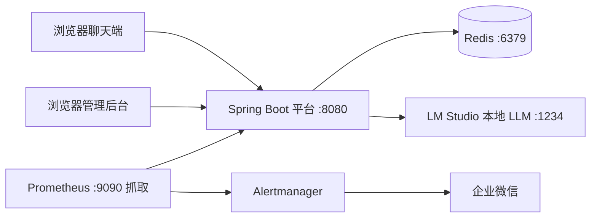

# SmartService-Agent 操作手册

> 版本：1.0 · 2026-09 · 配套：docs/PRD.md（需求）、docs/ARCHITECTURE.md（架构）
> 本文档覆盖：**各模块是什么 → 怎么启动 → 每个入口怎么用 → 出问题怎么办**

---

## 1. 项目全景

一套「多 Agent 智能客服平台」：用户通过网页提问，系统自动识别意图并路由到 7 个专家 Agent 之一回答；
运营人员通过管理后台监控平台健康与运营指标。全链路覆盖商用项目的完整环节。



### 模块职责速览

| 模块/目录 | 是什么 | 关键入口 |
|---|---|---|
| `python-prototype/` | 阶段一 Python 原型（Agent/记忆/RAG 概念验证） | 3 个 .py 脚本 |
| `java-agent-core/` | 阶段二 Java 单 Agent（工具调用 + RAG） | 可独立运行 |
| `java-agent-platform/` | **主服务**：多 Agent 编排 + API + 前端 + 监控 | 8080 端口 |
| `scripts/` | 运维脚本：健康告警 / E2E 冒烟 / 并发压测 | 见 §5.5 |
| `monitoring/` | Prometheus 抓取 + 告警规则 + Alertmanager 配置 | 见 §6.2 |
| `docs/` | PRD / 架构 / 本手册 | — |
| `.github/` | CI/CD 工作流 + Dependabot + PR/Issue 模板 | 见 §7 |

---

## 2. 环境准备

| 依赖 | 版本 | 说明 |
|---|---|---|
| JDK | 17 | 两个 Java 模块均要求 |
| Maven | 3.8+（本机 3.9.9） | 构建工具 |
| Redis | 6+（本机 7.x） | 会话 / 用户 / 限流存储，**必须启动** |
| LM Studio | 最新 | 本地 LLM 服务（**可挂**：FAQ 走关键词直查，服务照常可用） |
| Docker（可选） | Desktop | P3-1 容器化部署才需要 |

> 本机环境注意：Git Bash 的 `mvn` 命令指向旧版 3.6.3 会报错，请用
> `C:\maven\apache-maven-3.9.9-bin\apache-maven-3.9.9\bin\mvn.cmd` 全路径调用。

---

## 3. 启动项目（5 步）

### 第 1 步：启动 Redis
```bash
# Windows：运行 E:\bc\redis 下的 redis-server.exe，或：
redis-server
# 验证：redis-cli ping → PONG
```

### 第 2 步：启动 LM Studio（可选，建议）
1. 打开 LM Studio → 加载模型（如 qwen3vl-8b-uncensored）
2. 启动 Local Server（默认 `http://localhost:1234`）
> LLM 挂了不影响启动和 FAQ 问答，只是闲聊/复杂路由会降级。

### 第 3 步：构建（含测试 + 代码规范检查）
```bash
cd java-agent-platform
mvn -B verify          # 35 测试 + Checkstyle + Jacoco 覆盖率报告
```
> 测试自动使用 test profile（surefire 注入），无需手动指定。

### 第 4 步：启动服务
```bash
mvn spring-boot:run                              # 方式 A：开发运行（默认 dev profile）
java -jar target/java-agent-platform-1.0.0.jar   # 方式 B：jar 运行（生产加 --spring.profiles.active=prod）
```

### 第 5 步：访问入口
| 入口 | 地址 | 说明 |
|---|---|---|
| 聊天端 | http://localhost:8080/ | 用户对话 |
| 管理后台 | http://localhost:8080/admin.html | 先注册再登录 |
| Swagger | http://localhost:8080/swagger-ui/index.html | API 文档 + 在线调试 |
| 健康探针 | http://localhost:9090/actuator/health | 监控独立端口 9090 |
| Prometheus 指标 | http://localhost:9090/actuator/prometheus | 指标文本 |

---

## 4. 各模块操作说明

### 4.1 聊天端（用户视角）
- **功能**：SSE 流式打字机输出、意图路由标签（如「意图路由 → FAQ」）、多轮上下文（localStorage 持久化会话，刷新不丢）、快捷问题按钮。
- **试试这些**：`北京今天天气怎么样？`（Weather）· `帮我算一下 15*23+8`（Calc）· `智能手表多少钱？`（Sales）· `我要退货`（Return 状态机）· `电脑开不了机`（Tech）· `你好`（Chat）。
- **清空会话**：右上角按钮，删除 Redis 中的会话记录。

### 4.2 管理后台（运营视角）
- **登录**：首次使用点「没有账号？立即注册」→ 注册即登录（JWT 存 localStorage，24h 有效）。
- **总览**：三层健康（平台/Redis/LLM）、指标四卡（总请求/平均延迟/活跃会话/Token）、意图分布条形图。
- **会话管理**：会话列表（含最后活动时间），可删除异常会话；5 秒自动刷新。
- **Agent 状态**：7 个业务 Agent 注册列表。
- 右上角健康徽章：`LLM 异常` 表示 LM Studio 挂（服务可降级运行）。

### 4.3 API 层（开发者视角）
- **Swagger UI**：`/swagger-ui/index.html` → Authorize 粘贴 JWT token 后可调试受保护的管理端接口。
- **api-test.http**（根目录）：VS Code REST Client 可直接逐条执行全部接口用例。
- **统一响应体**：`{code, message, data}`，`code=0` 成功；业务错误码见各 Controller 文档。
- **SSE 流式**：`POST /api/agent/chat/stream` → `data: {token}` 逐块推送，结束发 `data: {done, intent}`。

### 4.4 认证与安全
- **JWT**：注册/登录签发 HS256 token（24h 过期），管理端接口需 `Authorization: Bearer <token>`。
- **密码**：BCrypt 单向加密存储（Redis hash `agent:user:{username}`）。
- **限流**：按客户端 IP 固定窗口——对话 10 次/分钟、登录 5 次/分钟，超限返回 `42900`。
- **审计**（P4-4）：登录/注册/删除会话等敏感操作记录到 `logs/audit.log`（保留 90 天）。

### 4.5 测试体系
| 命令 | 作用 |
|---|---|
| `mvn verify` | 35 单测 + Checkstyle 门禁 + Jacoco 覆盖率 |
| `mvn verify` 后 | 覆盖率报告在 `target/site/jacoco/index.html` |
| `bash scripts/smoke-test.sh` | E2E 冒烟：注册→对话→SSE→管理→健康 全链路 |
| `bash scripts/load-test.sh -c 20 -n 200` | 并发压测，输出 P50/P95/P99 + 成功率 |

---

## 5. 运维操作

### 5.1 日志
- 业务日志：`logs/agent-platform.log`（按日期+大小轮转，保留 7 天，gzip）。
- 审计日志：`logs/audit.log`（P4-4，保留 90 天）。
- 目录可用环境变量 `LOG_PATH` 覆盖。

### 5.2 健康检查与告警
```bash
bash scripts/health-check.sh    # 探测 9090/actuator/health 三层状态
# 退出码：0=全UP  1=Redis/平台DOWN(严重)  2=仅LLM DOWN(警告)  3=不可达
# 接入定时任务：Linux cron / Windows 计划任务，非 0 触发企业微信告警
```

### 5.3 监控（Prometheus / Alertmanager）
- 配置三件套在 `monitoring/`，Prometheus 抓取 `:9090/actuator/prometheus`（15s）。
- 告警规则：AgentDown / RedisDown / LlmDown（可降级警告）/ HighErrorRate（>20%）。
- Alertmanager 已配置企业微信 webhook（`monitoring/alertmanager.yml` 中替换你的 webhook 地址）。
- Prometheus 二进制可到 GitHub Releases 下载（国内需镜像，网络受限时保留配置交付）。

### 5.4 多环境部署
| 环境 | 激活方式 | 说明 |
|---|---|---|
| dev | 默认 | LM Studio + 本机 Redis + 演示 JWT |
| test | mvn verify 自动 | surefire 注入 `spring.profiles.active=test` |
| prod | `--spring.profiles.active=prod` | 全部环境变量注入（见 `application-prod.yml`），JWT 密钥必填否则启动失败 |

### 5.5 容器化（P3-1，需 Docker）
```bash
docker compose up -d --build     # 根目录 docker-compose.yml（含 healthcheck）
docker compose logs -f platform
```

---

## 6. CI/CD（GitHub Actions）

推送 main/develop 或提 PR 时触发，4 个 job **并行**：
1. `test-java-core`：编译 + Checkstyle
2. `test-java-platform`：35 测试 + Checkstyle + Jacoco 覆盖率（artifact）
3. `test-python-prototype`：py_compile 语法检查
4. `build-and-push-docker`（仅 main push）：buildx 构建 → 推送 GHCR

配套：Dependabot 每周自动检查依赖更新；PR/Issue 模板统一协作格式。

> 本地模拟 CI：`cd java-agent-platform && mvn -B verify && cd ../java-agent-core && mvn -B verify && cd ../python-prototype && python -m py_compile day*.py`

---

## 7. 常见问题与故障排查

| 现象 | 原因 | 解决 |
|---|---|---|
| 启动报 Redis 连接失败 | Redis 没起 | 启动 redis-server，`redis-cli ping` |
| `mvn` 报 ClassNotFoundException | PATH 里是旧版 Maven | 用全路径 `C:\maven\apache-maven-3.9.9-bin\...\mvn.cmd` |
| 构建失败 `Unable to rename jar` | 8080 有旧进程锁 jar | 停掉旧 java 进程再构建 |
| 管理后台登录 401 | token 过期 | 重新登录 |
| 聊天一直返回 FAQ | LM Studio 没起/模型未加载 | 启动 LM Studio 并加载模型；这是设计的降级路径 |
| 42900 限流 | 同 IP 超 10 次/分 | 等窗口刷新或改 `agent.rate-limit.chat-per-minute` |
| 修改配置不生效 | 未重启 | 改完 application*.yml 需重启服务（**改代码后也要重启**） |
| actuator 9090 连不上 | 服务没起或端口被占 | `netstat -ano | findstr 9090` 检查 |
| 审计日志没内容 | 未触发敏感操作 | 登录/删除会话后再看 `logs/audit.log` |

---

## 8. 商用流程对照（学习者视角）

| 商用环节 | 本项目对应 | 进一步学习方向 |
|---|---|---|
| 需求分析 | docs/PRD.md | 用户调研、竞品分析 |
| 架构设计 | docs/ARCHITECTURE.md | 领域驱动设计、微服务拆分 |
| 编码规范 | config/checkstyle.xml + .editorconfig | SpotBugs、SonarQube |
| 代码评审 | .github/PULL_REQUEST_TEMPLATE.md | Review 流程实践 |
| 测试 | 35 单测 + Jacoco + smoke/load-test | TDD、契约测试、混沌工程 |
| 安全 | JWT + BCrypt + 限流 + 审计 | OWASP Top 10、渗透测试 |
| 部署 | Docker + compose + GHCR | K8s、蓝绿发布 |
| 监控运维 | Actuator + Prometheus + Alertmanager + 日志 | 日志集中采集、SLO |
| 持续交付 | GitHub Actions 4 job | 多环境流水线、金丝雀发布 |
